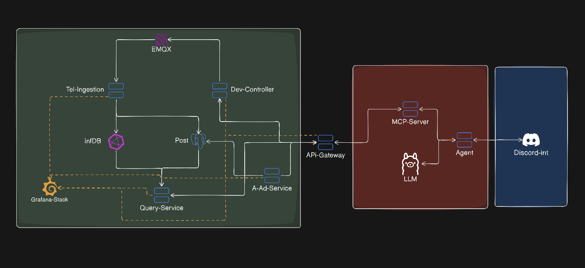
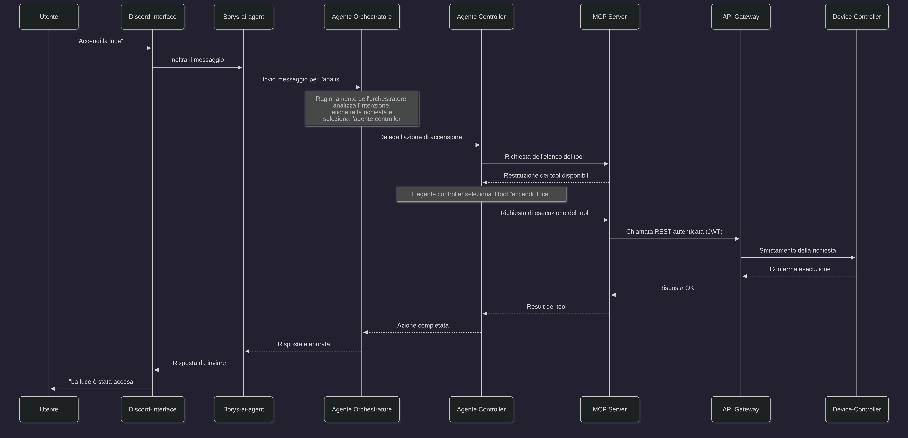

# 🤖 Borys

**Borys** è un assistente AI per la gestione di dispositivi IoT all'interno di un'azienda o di un'abitazione privata. Il sistema permette di controllare e monitorare i dispositivi attraverso una chat interattiva in linguaggio naturale, utilizzando come interfaccia di comunicazione la piattaforma Discord.

## Funzionalità

- **Invio comandi ai dispositivi IoT** — accendi, spegni e regola i dispositivi con semplici messaggi in linguaggio naturale
- **Monitoraggio dello stato** — interroga l'assistente per conoscere lo stato attuale di ogni dispositivo
- **Sistema di allarmi** — ricevi notifiche automatiche in caso di comportamenti anomali dei dispositivi
- **Interazione via Discord** — comunica con l'assistente tramite una piattaforma di messaggistica già diffusa, senza applicazioni dedicate
- **Pianificazione intelligente** — richiedi un piano di gestione dei dispositivi in vista di un evento programmato
- **Privacy-first** — tutti i dati vengono elaborati interamente in locale tramite un modello linguistico on-premise

## 🏗️ Architettura

Il progetto è suddiviso in tre macro-aree: il **backend** Go, la **parte AI** basata su Quarkus, e l'**interfaccia Discord** in Python.



### Backend (Go)

| Microservizio | Ruolo |
| --- | --- |
| **Telemetry-Ingestion** | Riceve i dati dal broker MQTT e li salva nei database |
| **Device-Controller** | Invia i comandi di controllo ai dispositivi IoT |
| **Query-Service** | Espone i dati dei dispositivi all'esterno |
| **Auth-Admin-Service** | Genera i token JWT e gestisce il pannello amministrativo |
| **API-Gateway** | Punto unico di ingresso, verifica dei permessi e smistamento delle richieste |

### Database

- **PostgreSQL** — anagrafica dei dispositivi IoT, dati in tempo reale e gestione utenti
- **InfluxDB** — storico dei dati ambientali come serie temporali

### Parte AI

| Componente | Tecnologia | Avvio |
| --- | --- | --- |
| **Ollama** | Docker (Qwen 2.5 3B) | `docker compose up -d` |
| **borys-ai-agent** | Quarkus + LangChain4j | `./start.sh` (porta 9090) |
| **mcp-server** | Quarkus + MCP Server | `./start.sh` (porta 9100) |

### Agenti AI

| Agente | Ruolo |
| --- | --- |
| 🤖 **Orchestratore** | Riceve il messaggio dell'utente, identifica l'intenzione e instrada la richiesta all'agente competente |
| 📊 **Query (Lettura)** | Risponde alle domande sullo stato attuale dei dispositivi |
| 🎮 **Controller (Azione)** | Unico agente autorizzato a inviare comandi ai dispositivi tramite i tool MCP |
| 🚨 **Allarmi** | Monitora i dati di telemetria e genera notifiche in caso di anomalie |

### Interfaccia Discord (Python)

- **FastAPI** — espone gli endpoint di comunicazione verso la parte Quarkus
- **discord.py** — gestisce l'interazione con la piattaforma Discord

## Flusso di Esecuzione

Il flusso ha inizio quando l'utente invia la richiesta "Accendi la luce" attraverso la piattaforma Discord, e si articola nei seguenti passaggi:



- Il messaggio viene catturato dal **Discord-Interface**, che lo inoltra al container **borys-ai-agent**
- L'**Agente Orchestratore** analizza il contenuto del messaggio, ne identifica l'intenzione e, attraverso il pattern Router, seleziona l'**Agente Controller** come destinatario del compito
- L'**Agente Controller** richiede al **server MCP** l'elenco dei tool disponibili, seleziona il tool appropriato per l'operazione di accensione e ne richiede l'esecuzione
- Il **server MCP** traduce la richiesta in una chiamata REST HTTP autenticata tramite token JWT verso l'**API Gateway**
- L'**API Gateway** verifica i permessi e smista la richiesta al microservizio backend competente, in questo caso il **Device-Controller**
- Il **Device-Controller** pubblica il comando sul broker **MQTT (EMQX)** affinché il dispositivo esegua l'accensione della luce

## 🔒 Sicurezza e Permessi

- **Utenti** — autenticazione delegata interamente a Discord
- **Agenti AI** — ciascun agente possiede un token JWT che ne delimita i permessi operativi (principio del minimo privilegio)
- **Amministratori** — accesso al pannello amministrativo protetto da token JWT dedicato


## Avvio

### Prerequisiti

- Java 21 (JDK)
- Docker e Docker Compose
- Python 3.12+ (per Discord-Interface, opzionale)
- Ollama (se non usi Docker per il modello)

### 1. Avvia Ollama (modello LLM)

```bash
docker compose up -d
docker compose exec ollama ollama pull qwen2.5:3b
```

### 2. Avvia i servizi Quarkus

**Linux / macOS:**
```bash
./start.sh
```

**Windows:**
```cmd
start.bat
```

Lo script avvia in parallelo:
- **borys-mcp-server** su `localhost:9100`
- **borys-ai-agent** su `localhost:9090`


### 3. Avvia il bot Discord

```bash
cd Discord-iterface
cp .env.example .env   # inserisci il token del bot
uv sync
uv run main.py
```

## Sviluppi futuri

- Integrazione di ulteriori piattaforme di messaggistica (WhatsApp, Telegram)
- Introduzione di Redis per la memorizzazione delle conversazioni
- Agente dedicato alla pianificazione della gestione dei dispositivi in vista di eventi
- Gestione centralizzata degli utenti con permessi granulari per piattaforma
- Modello di machine learning per il controllo degli accessi in base alla stanza
- Gestione di telecamere con riconoscimento del movimento
- Controllo di robot esterni (pulizia piscina, rasaerba) e sistemi di irrigazione


## Dipendenze  Attualmente Presenti


#### borys-ai-agent

| Dipendenza | Scopo |
| --- | --- |
| `quarkus-langchain4j-ollama` | Integrazione con Ollama per il modello Qwen 2.5 3B |
| `quarkus-langchain4j-mcp` | Client MCP — connessione al borys-mcp-server per accedere ai tool |
| `quarkus-rest-jackson` | Endpoint REST con serializzazione JSON (DTO request/response) |
| `quarkus-opentelemetry` | Tracing e monitoraggio distribuito degli agenti AI |
| `quarkus-config-yaml` | Lettura della configurazione da `application.yml` |
| `quarkus-arc` | Dependency injection (CDI) |

#### borys-mcp-server

| Dipendenza | Scopo |
| --- | --- |
| `quarkus-mcp-server-http` | Server MCP — espone i `@Tool` come endpoint HTTP per gli agenti |
| `quarkus-rest-jackson` | Endpoint REST per la comunicazione con il backend Go |
| `quarkus-config-yaml` | Lettura della configurazione da `application.yml` |
| `quarkus-arc` | Dependency injection (CDI) |

#### Modello LLM

| Componente | Dettagli |
| --- | --- |
| **Ollama** | Runtime locale per l'inferenza |
| **Qwen 2.5 3B** | Modello quantizzato, scegliato per basso consumo di risorse |
